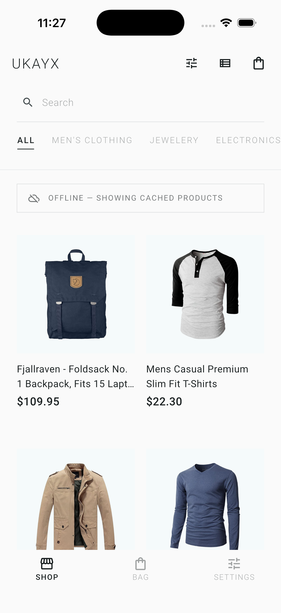
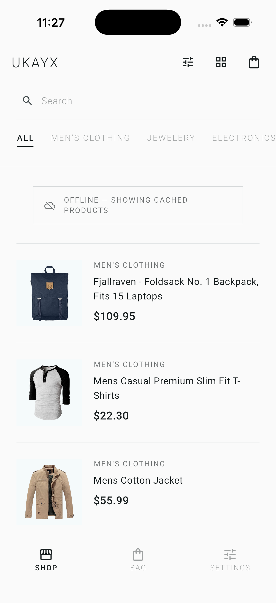
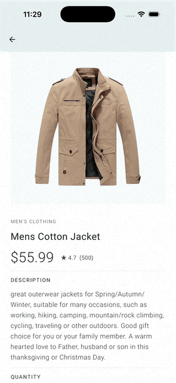
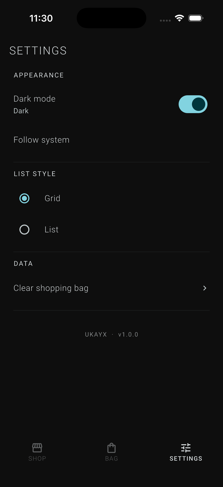
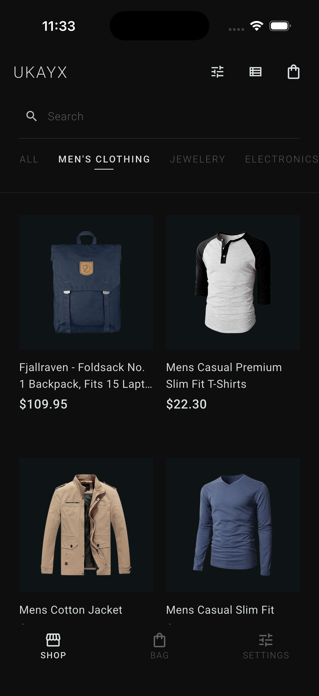

# 🛒 E-Commerce Shopping App

A friendly little Flutter capstone built around the **Cubit** pattern, the **FakeStore API**, and **SharedPreferences** for local persistence. It's the Week 4 project that ties everything from the bootcamp together — UI, navigation, networking, state management, and offline support — in one tidy app you can actually shop in.

> **Stack at a glance:** Flutter • Cubit (`flutter_bloc`) • `http` • `SharedPreferences` • `cached_network_image`

---

## ✨ What it does

- **Browse products** in a grid or list — your choice, toggleable from the app bar.
- **Pull to refresh** the catalog without flickering a spinner (refresh stays snappy).
- **Search & filter locally** — by title/description, by category tab, by price range, and sortable by price/rating/name. Zero extra API calls.
- **Tap into a product detail** with full info, a quantity selector, and a satisfying "Added to cart" snackbar.
- **Manage a cart** with +/- quantity, remove, subtotals, totals, and a friendly empty state.
- **Cart survives app restarts** thanks to SharedPreferences.
- **Dark mode toggle** in Settings, also persisted.
- **Works offline** — last successful product fetch is cached, so the app still has something to show when the network is grumpy.
- **Graceful errors** with retry buttons rather than scary stack traces.

---

## 🌐 API

Powered by the wonderful [FakeStore API](https://fakestoreapi.com/). Only two endpoints — everything else (search, categories, sorting) happens **locally** on cached data.

| Method | Endpoint | Used for |
|--------|----------|----------|
| GET | `/products` | Initial load + refresh |
| GET | `/products/{id}` | Product detail screen |

All HTTP calls are wrapped in `try/catch` with a 10-second timeout, and failures map to a clean `Error` state in the Cubit.

---

## 🧠 State Management Architecture

The whole app runs on **three Cubits**, each with one job:

| Cubit | Responsibilities |
|-------|------------------|
| `ProductCubit` | `loadProducts()`, `refreshProducts()`, `searchProducts()`, `filterByCategory()`, `sortProducts()` |
| `CartCubit` | `addItem()`, `removeItem()`, `updateQuantity()`, `clearCart()` + persistence |
| `ThemeCubit` | `toggleTheme()`, `setDarkMode()`, `setLightMode()` + persistence |

The mental model is delightfully boring (in a good way):

```
UI → user action → method call on Cubit → emit new State → UI rebuilds
```

A few rules I tried hard to honour:

- **States are immutable.** Every change emits a fresh object via `copyWith` — no mutating lists in place.
- **Builders are pure; listeners do side effects.** Snackbars and navigation live in `BlocListener`, not `BlocBuilder`.
- **Persist in the Cubit, not the UI.** The screens have no idea SharedPreferences exists.
- **Hydrate on construction** so the cart and theme feel instantaneous on cold start.
- **Cache aggressively, network sparingly.** Search/filter/sort all run against the in-memory list.

---

## 📁 Project Structure

```
ecommerce_app/
├── lib/
│   ├── main.dart                  # App entry + MultiBlocProvider wiring
│   ├── api/
│   │   └── api_service.dart       # http calls, timeouts, error mapping
│   ├── models/
│   │   ├── product.dart           # fromJson / toJson
│   │   └── cart_item.dart         # cart line item + serialization
│   ├── cubits/
│   │   ├── product/               # product_cubit.dart + product_state.dart
│   │   ├── cart/                  # cart_cubit.dart  + cart_state.dart
│   │   └── theme/                 # theme_cubit.dart + theme_state.dart
│   ├── screens/
│   │   ├── home_screen.dart
│   │   ├── product_detail_screen.dart
│   │   ├── cart_screen.dart
│   │   ├── settings_screen.dart
│   │   └── main_shell.dart        # bottom-nav scaffold
│   ├── widgets/                   # product_card, category_tabs, error_view, etc.
│   └── theme/
│       └── app_theme.dart         # light + dark ThemeData
└── test/
    ├── cubits/                    # Cubit unit tests with bloc_test
    └── helpers/                   # mocks + fixtures
```

Folders are organized **by feature** (`cubits/cart/`, `cubits/product/`, …) rather than by type — easier to find things, and easier to delete a feature in one go later.

---

## 🚀 Running it

```bash
# from the repo root
cd ecommerce_app
flutter pub get
flutter run
```

Tested on the Flutter SDK pinned in `.fvmrc`. If you use [fvm](https://fvm.app/), `fvm flutter run` works out of the box.

To run tests:

```bash
flutter test
```

---

## 📸 Screenshots

| # | Screen | Preview |
|:-:|:--|:--:|
| 1 | Home screen — product grid |  |
| 2 | Home screen — product list view |  |
| 3 | Product detail screen |  |
| 4 | Shopping cart with items | _Coming soon_ |
| 5 | Empty cart state |  |
| 6 | Settings screen with dark mode |  |
| 7 | Search / filter in action |  |
| 8 | Error state with retry button |  |
| 9 | Dark mode theme |  |

---

## ✅ Feature Checklist

**State Management (Cubit)**
- [x] `ProductCubit` — load, refresh, search, filter, sort
- [x] `CartCubit` — add, remove, update quantity, clear, persistence
- [x] `ThemeCubit` — toggle dark/light, persistence
- [x] All states are immutable; every update emits a new object
- [x] `BlocProvider`, `BlocBuilder`, `BlocListener` used appropriately
- [x] No event classes — direct method calls, true to Cubit style

**API & Data**
- [x] `GET /products` and `GET /products/{id}` working
- [x] Product & CartItem models with `fromJson` / `toJson`
- [x] 10-second timeout, try/catch, friendly error mapping
- [x] Offline mode with cached products

**UI / UX**
- [x] Grid + list view toggle
- [x] Pull-to-refresh (spinner-free)
- [x] Loading and error states with retry
- [x] Cart badge with item count
- [x] Search bar + category tabs + sort options
- [x] Smooth navigation between screens

**Persistence**
- [x] Cart serialized to SharedPreferences as JSON
- [x] Product list cached for offline use
- [x] Dark mode + view mode preferences saved

**Code Quality**
- [x] Feature-based folder structure
- [x] No debug prints in production code
- [x] Cubit unit tests with `bloc_test`

---

## 💡 What I learned

A few things really clicked while building this:

1. **Cubit's simplicity is a feature, not a limitation.** Direct method calls keep the call sites readable, and you only really miss events when you genuinely need event-driven traceability or stream transformations.
2. **Immutability is non-negotiable.** The first time the UI didn't rebuild after I "added" something, it was because I'd mutated the existing list. `copyWith` everywhere fixed it forever.
3. **Refresh shouldn't show a spinner.** Skipping the `Loading` emit on `refreshProducts()` makes pull-to-refresh feel instant — a tiny UX win that costs nothing.
4. **Persist in the Cubit constructor.** Hydrating cart + theme before the first frame means the app never "flashes" empty.
5. **Cache aggressively, network sparingly.** Doing search/filter/sort locally on the in-memory list is faster, cheaper, and works offline for free.

---

## 📚 References

- [bloclibrary.dev](https://bloclibrary.dev/) — official Bloc/Cubit docs
- [`flutter_bloc` on pub.dev](https://pub.dev/packages/flutter_bloc)
- [`bloc_test`](https://pub.dev/packages/bloc_test) — for testing Cubits without rendering
- [FakeStore API](https://fakestoreapi.com/)
- [SharedPreferences](https://docs.flutter.dev/cookbook/persistence/key-value)
